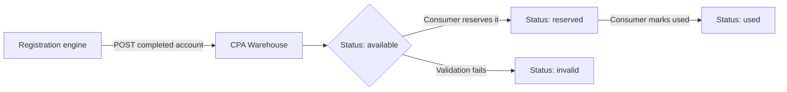

The CPA Warehouse is the persistent storage layer at the heart of the OpenAI CPA system. After the browser or protocol engine completes an account registration, it writes the resulting account record to the warehouse. Every downstream component — including [Sub2API](/warehouses/sub2api) and any third-party integration — reads from this single source of truth. Understanding how accounts flow in, what each record contains, and how status changes over an account's lifetime is essential before building anything on top of the warehouse.

## How accounts flow in

Accounts enter the warehouse automatically once the [browser engine](/engines/browser-engine) or [protocol engine](/engines/protocol-engine) finishes a registration task. The engine posts the completed record directly to the warehouse; no manual step is required. Each account is written exactly once and assigned an initial status of `available`.



<Note>
  The warehouse is append-only for engine writes. Status transitions are the only mutations allowed after the initial write.
</Note>

## Account record structure

Every account record stored in the warehouse contains the following fields.

| Field | Type | Description |
|---|---|---|
| `id` | string (UUID) | Immutable unique identifier assigned at write time. |
| `username` | string | The username registered with the target platform. |
| `password` | string | The account password, stored encrypted at rest. |
| `email` | string | The email address used during registration. |
| `registration_date` | ISO 8601 timestamp | UTC timestamp of when the engine completed registration. |
| `status` | enum | Current lifecycle state: `available`, `reserved`, `used`, or `invalid`. |
| `tags` | string[] | Arbitrary labels such as platform name, engine type, or region. |
| `engine_type` | string | Which engine created the account: `browser` or `protocol`. |
| `platform` | string | The target platform identifier (e.g., `openai`, `google`). |
| `metadata` | object | Freeform key-value pairs written by the engine at registration time. |

<Tip>
  Use `tags` and `platform` to partition accounts by campaign or use case. Filtering by these fields via [Sub2API](/warehouses/sub2api) is the most efficient way to serve specific account pools to different consumers.
</Tip>

## Account status lifecycle

An account moves through a defined set of statuses from the moment it is written to the warehouse until it is retired.

<Tabs>
  <Tab title="available">
    The account has been registered and validated. It is ready to be claimed by a consumer via [Sub2API](/warehouses/sub2api). This is the initial status for every new account.
  </Tab>
  <Tab title="reserved">
    A consumer has called `POST /accounts/:id/reserve`. The account is locked for that consumer and will not be returned in list responses to other consumers unless the `include_reserved` filter is set.
  </Tab>
  <Tab title="used">
    The consumer has called `POST /accounts/:id/use`, confirming the account has been consumed. Used accounts remain in the warehouse for auditing but are excluded from default list queries.
  </Tab>
  <Tab title="invalid">
    The account failed post-registration validation or was flagged during a health check. Invalid accounts are retained for diagnostics and can be reviewed in the operations dashboard.
  </Tab>
</Tabs>

<Warning>
  Status transitions are one-way. An account cannot move from `used` back to `available`. If you need to re-use credentials, create a new registration task through the [cluster](/cluster/overview).
</Warning>

## Querying accounts

You can retrieve accounts from the warehouse directly through [Sub2API](/warehouses/sub2api), which exposes a REST interface over the warehouse. Refer to the [Sub2API reference](/warehouses/sub2api) for full endpoint documentation including filter parameters.

Common query patterns:

- **By status** — fetch only `available` accounts ready for consumption.
- **By platform** — scope results to a specific target platform using the `platform` query parameter.
- **By tag** — filter by one or more tags to target a specific campaign pool.
- **By date range** — use `registered_after` and `registered_before` to bound results by registration date.

## Exporting accounts

The warehouse supports several export formats for offline analysis or handoff to external systems.

<AccordionGroup>
  <Accordion title="CSV export">
    Request a CSV export through the operations dashboard or via the `GET /accounts/export?format=csv` endpoint. The export includes all fields except `password` unless the `include_credentials` flag is explicitly set and your API key has credential-export permission.

    ```bash
    curl -X GET "https://your-instance/accounts/export?format=csv&status=available" \
      -H "Authorization: Bearer <key>" \
      --output accounts.csv
    ```
  </Accordion>
  <Accordion title="JSON export">
    JSON export returns a newline-delimited JSON (NDJSON) stream, suitable for piping into data pipelines or bulk import tools.

    ```bash
    curl -X GET "https://your-instance/accounts/export?format=ndjson&platform=openai" \
      -H "Authorization: Bearer <key>" \
      --output accounts.ndjson
    ```
  </Accordion>
  <Accordion title="Webhook-based delivery">
    Rather than polling for exports, configure a webhook so the warehouse pushes batches to your endpoint as soon as new accounts are written. See [Integration](/warehouses/integration) for setup instructions.
  </Accordion>
  <Accordion title="Scheduled exports">
    You can schedule recurring CSV or JSON exports from the operations dashboard under **Warehouses > Export schedules**. Exports are delivered to a configured S3-compatible bucket or SFTP destination.
  </Accordion>
</AccordionGroup>

## Related pages

<CardGroup cols={2}>
  <Card title="Sub2API" icon="plug" href="/warehouses/sub2api">
    HTTP REST API that exposes warehouse accounts to downstream consumers.
  </Card>
  <Card title="Integration guide" icon="link" href="/warehouses/integration">
    Connect third-party systems to the warehouse via Sub2API and webhooks.
  </Card>
  <Card title="Browser engine" icon="globe" href="/engines/browser-engine">
    The engine that registers accounts and writes them to the warehouse.
  </Card>
  <Card title="Operations & monitoring" icon="chart-line" href="/operations/monitoring">
    Monitor warehouse health, write rates, and storage utilization.
  </Card>
</CardGroup>
