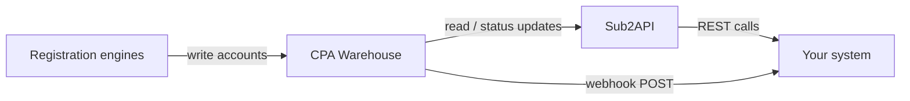

The [CPA Warehouse](/warehouses/cpa-warehouse) and [Sub2API](/warehouses/sub2api) are designed to work together as a single pipeline: the warehouse stores every registered account, and Sub2API exposes those accounts to any downstream consumer through a standard HTTP interface. This page explains how to wire an external system — an automation tool, a SaaS platform, or a custom service — into that pipeline, including how to receive real-time notifications when new account batches arrive and how to filter the account pool precisely for your use case.

## How the warehouse and Sub2API work together

When a registration engine completes an account, it writes the record directly to the CPA Warehouse. Sub2API continuously serves the current state of the warehouse to consumers. The two components share the same underlying data store, so any account written by an engine is immediately queryable through Sub2API — there is no replication delay or sync step required.



<Note>
  All consumer interactions with the warehouse should go through Sub2API. Direct database access is not supported and may be blocked at the network level depending on your [deployment](/operations/deployment) configuration.
</Note>

## Setting up a full integration

<Steps>
  <Step title="Obtain an API key">
    Log in to the operations dashboard and navigate to **Settings > API Keys**. Create a new key for your integration and note the permissions you need:

    - `read` — list and retrieve accounts
    - `reserve` — call `POST /accounts/:id/reserve`
    - `use` — call `POST /accounts/:id/use`

    Store the key in a secret manager or environment variable. Never hard-code it in source files.

    ```bash
    export SUB2API_KEY="your-api-key-here"
    ```
  </Step>

  <Step title="Verify connectivity">
    Confirm your system can reach Sub2API and that the key is valid by listing a small page of accounts.

    ```bash
    curl -X GET "https://your-instance/api/v1/accounts?limit=1" \
      -H "Authorization: Bearer $SUB2API_KEY"
    ```

    A `200 OK` response with an `accounts` array confirms the connection is working. If you receive a `401`, review the [authentication section of the Sub2API reference](/warehouses/sub2api).
  </Step>

  <Step title="Configure account filters">
    Decide which subset of the warehouse your system needs. Use query parameters on `GET /accounts` to scope results:

    - `platform` — limit to accounts for a specific target platform
    - `tags` — filter by one or more campaign or engine-type tags
    - `registered_after` / `registered_before` — bound by registration date
    - `status` — default is `available`; set explicitly to avoid ambiguity

    See [filtering accounts by tags and platform](#filtering-accounts-by-tags-and-platform) below for detailed examples.
  </Step>

  <Step title="Register a webhook endpoint">
    To receive push notifications when the warehouse receives a new batch of accounts, register your webhook URL from the operations dashboard under **Warehouses > Webhooks > Add endpoint**. Provide:

    - **URL** — a publicly reachable HTTPS endpoint on your system
    - **Secret** — a shared secret used to verify webhook signatures
    - **Filters** (optional) — restrict notifications to specific platforms or tags

    Alternatively, use the management API:

    ```bash
    curl -X POST "https://your-instance/api/v1/webhooks" \
      -H "Authorization: Bearer $SUB2API_KEY" \
      -H "Content-Type: application/json" \
      -d '{
        "url": "https://your-system.example.com/hooks/cpa-accounts",
        "secret": "your-webhook-secret",
        "filters": {
          "platform": "openai",
          "tags": ["campaign-q2"]
        }
      }'
    ```
  </Step>

  <Step title="Implement webhook handling">
    Your endpoint must accept `POST` requests with the JSON payload described in [webhook payload format](#webhook-payload-format). Respond with `200 OK` within 10 seconds. If Sub2API does not receive a `2xx` response, it retries with exponential backoff up to five times before marking the delivery as failed.

    ```python
    import hmac, hashlib, json
    from flask import Flask, request, abort

    app = Flask(__name__)
    WEBHOOK_SECRET = b"your-webhook-secret"

    @app.route("/hooks/cpa-accounts", methods=["POST"])
    def handle_webhook():
        signature = request.headers.get("X-CPA-Signature-256", "")
        body = request.get_data()
        expected = "sha256=" + hmac.new(WEBHOOK_SECRET, body, hashlib.sha256).hexdigest()
        if not hmac.compare_digest(signature, expected):
            abort(401)
        payload = json.loads(body)
        process_new_accounts(payload["accounts"])
        return "", 200
    ```

    <Warning>
      Always verify the webhook signature before processing the payload. Skipping verification exposes your system to spoofed requests.
    </Warning>
  </Step>

  <Step title="Reserve and consume accounts">
    Once your system identifies accounts it wants to use, reserve them to prevent other consumers from claiming them, then mark them as used after consumption.

    ```bash
    # Reserve
    curl -X POST "https://your-instance/api/v1/accounts/$ACCOUNT_ID/reserve" \
      -H "Authorization: Bearer $SUB2API_KEY"

    # Mark as used
    curl -X POST "https://your-instance/api/v1/accounts/$ACCOUNT_ID/use" \
      -H "Authorization: Bearer $SUB2API_KEY"
    ```
  </Step>
</Steps>

## Webhook payload format

Sub2API sends a `POST` request to your configured endpoint each time a new batch of accounts is written to the warehouse. The payload contains a summary of the batch and the individual account records.

```json
{
  "event": "accounts.batch_added",
  "batch_id": "batch_20260424_001",
  "timestamp": "2026-04-24T10:00:00Z",
  "count": 3,
  "accounts": [
    {
      "id": "a1b2c3d4-e5f6-7890-abcd-ef1234567890",
      "username": "user_abc123",
      "email": "user_abc123@mailbox.example",
      "status": "available",
      "platform": "openai",
      "tags": ["campaign-q2", "browser"],
      "registration_date": "2026-04-24T09:58:12Z",
      "engine_type": "browser"
    },
    {
      "id": "b2c3d4e5-f6a7-8901-bcde-f12345678901",
      "username": "user_def456",
      "email": "user_def456@mailbox.example",
      "status": "available",
      "platform": "openai",
      "tags": ["campaign-q2", "protocol"],
      "registration_date": "2026-04-24T09:58:45Z",
      "engine_type": "protocol"
    }
  ]
}
```

The `X-CPA-Signature-256` header contains an HMAC-SHA256 signature of the raw request body using the shared secret you configured at registration time.

<Tip>
  Store the `batch_id` in your system to deduplicate retried webhook deliveries. Sub2API may deliver the same batch more than once if the first delivery times out.
</Tip>

## Filtering accounts by tags and platform

Tags and the `platform` field are the primary tools for partitioning the warehouse into pools for different consumers. Tags are free-form strings applied by the registration engine at write time — common conventions include the campaign name, engine type, and regional identifier.

<Tabs>
  <Tab title="Filter by platform">
    ```bash
    curl -X GET "https://your-instance/api/v1/accounts?platform=openai&status=available" \
      -H "Authorization: Bearer $SUB2API_KEY"
    ```
  </Tab>
  <Tab title="Filter by tags">
    Pass multiple tags as a comma-separated list. Only accounts that match **all** specified tags are returned.

    ```bash
    curl -X GET "https://your-instance/api/v1/accounts?tags=campaign-q2,browser&status=available" \
      -H "Authorization: Bearer $SUB2API_KEY"
    ```
  </Tab>
  <Tab title="Filter by date range">
    ```bash
    curl -X GET "https://your-instance/api/v1/accounts?registered_after=2026-04-01T00:00:00Z&registered_before=2026-04-30T23:59:59Z&status=available" \
      -H "Authorization: Bearer $SUB2API_KEY"
    ```
  </Tab>
  <Tab title="Combined filters">
    Combine parameters to build precise queries:

    ```bash
    curl -X GET "https://your-instance/api/v1/accounts?platform=openai&tags=campaign-q2&registered_after=2026-04-01T00:00:00Z&status=available&limit=50" \
      -H "Authorization: Bearer $SUB2API_KEY"
    ```
  </Tab>
</Tabs>

## Connecting common third-party systems

<AccordionGroup>
  <Accordion title="Zapier / Make (no-code platforms)">
    Use a **Webhooks by Zapier** or **Make HTTP** module to receive the webhook payload, then map the `accounts` array fields to your downstream app (Google Sheets, Airtable, Slack, etc.). Set the webhook URL in the CPA dashboard and use Zapier's built-in HMAC verification step to validate signatures.
  </Accordion>
  <Accordion title="n8n">
    Create a **Webhook** trigger node pointed at your n8n instance. Add a **Function** node to verify the `X-CPA-Signature-256` header, then use **HTTP Request** nodes to call Sub2API to reserve and use accounts as your workflow progresses.
  </Accordion>
  <Accordion title="Custom microservice">
    Implement a lightweight service that exposes a single POST endpoint for webhooks, polls `GET /accounts` on a schedule as a fallback, and manages reservation state in its own database. This pattern is recommended for high-throughput consumers that process thousands of accounts per hour.
  </Accordion>
  <Accordion title="Message queues (Kafka, RabbitMQ, SQS)">
    Deploy a small bridge service that receives Sub2API webhook payloads and publishes each account as an individual message to your queue. Downstream workers then consume from the queue, call `POST /accounts/:id/reserve` before processing, and `POST /accounts/:id/use` on completion.
  </Accordion>
</AccordionGroup>

## Related pages

<CardGroup cols={2}>
  <Card title="CPA Warehouse" icon="database" href="/warehouses/cpa-warehouse">
    Account record structure, status lifecycle, and export options.
  </Card>
  <Card title="Sub2API reference" icon="plug" href="/warehouses/sub2api">
    Full endpoint documentation, parameters, and response schemas.
  </Card>
  <Card title="Monitoring" icon="chart-line" href="/operations/monitoring">
    Track webhook delivery success rates and account consumption metrics.
  </Card>
  <Card title="Troubleshooting" icon="wrench" href="/operations/troubleshooting">
    Diagnose failed webhook deliveries and integration errors.
  </Card>
</CardGroup>
